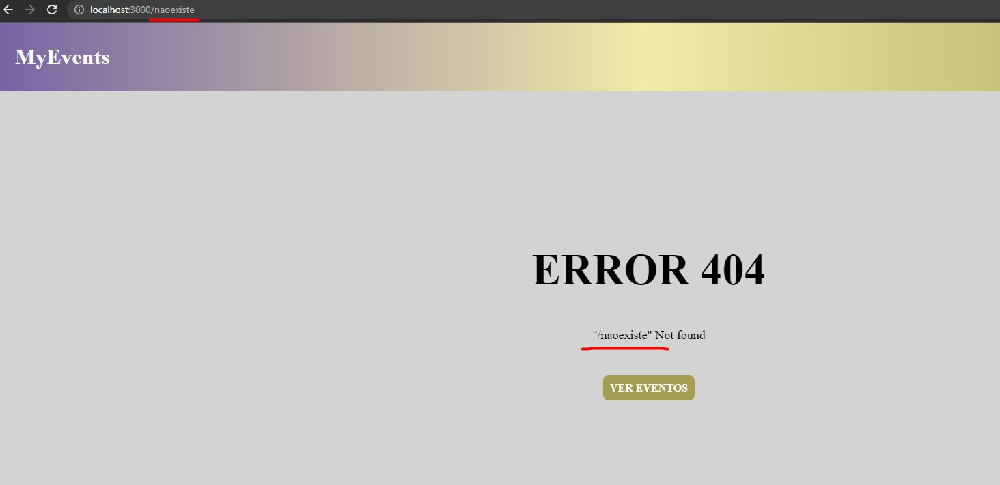

# :notebook: Sobre o Projeto

<div align="center">
   
   
   
   
</div>

<div align="center">
   <h1> MyEvents </h1>
</div>

## 💻 Pré-requisitos

Antes de começar, verifique se você atendeu aos seguintes requisitos:

<!---Estes são apenas requisitos de exemplo. Adicionar, duplicar ou remover conforme necessário--->

- Você instalou a versão mais recente de `<npm / v8.x+>` e `<Node/ v14 lts>`

## :computer: Como Utilizar Localmente

Para rodar na sua máquina, baixe o repositório em sua máquina local e abra seu console no diretório onde está localizado o projeto. Após isso digite:

`npm install ` para instalar as dependências do projeto

E Para rodar o projeto localmente:

`npm run dev` 

## :star: Tecnologias Utilizadas

![PhosphorIcons](data:image/png;base64,iVBORw0KGgoAAAANSUhEUgAAAOEAAADhCAMAAAAJbSJIAAABBVBMVEX////+z10AAACcV///qCrYkP4BqTj/0l7/1GCgWf/Lq01lOadBK03/rSv+zlrhlf/+zlMBrzpaRyGphj0AORObZrIAXR9oShL/+er/8dX/+/P+13j/35X/8M3/6LX+zk7/13H/89z/5qj+3ov/7cQ6IGDSjPP/2WIAMRCXezdSQh5kUCR7Yy3Dn0jyxllAMxejhT2harkuHjZIKHZxP7ZTLooIAxCIbjOGWZyHS9sSCR4dFAnhuVTSq00OCQN9Rs5/VBXxnyeOUOkuJBF7UY7jliWCVBUpF0S2lUMYDx4xG1GJWqFeNZtiQBA8IGJGOBkfETQAHwoAhCwAlDAoIRABURsAciYnxOozAAAF8klEQVR4nO2cfVPbRhCHsUwjqRQjF9IYjC3bvBjzYmgIpIS3vDSFNoSkSZvv/1F6d7Jsyd6VZDsdrT2/ZyZ/xcPomb3bvduTbmEBAAAAAAAAAAAAAAAAAAAAAAAAAAAAAAAAAAAAAAAAAAAAAAD8f2xUmuuaZmUj70f57mys1zcbnu+F+F5js74+N57NetX2vFKpEKVU8jy7Wm/m/XDTU2k1fC8uF9H0/EarkvcjTkWtyuv1Jau1vB9zYrYbKXqhZGM770ediFo2v57j7MWxsuVn9Qsct2ZsPtbtcfyMo13P+6HHoFL1xvTTeNWZCWNtrAEaCaM/I7OxNUkAe2Fs5f3wWdicXFApbub9+OlsTSOoFLfyFkhjSkH5ilMLSlecag72FQXPxSmyaExRbEatZV6IpikKrYuV7xNBoyhzdVMdjaCTQJJhqZq3DEV9NIROZ/9nkoPDk6Ou49h8EAUuwyujuwn7RyuJ45Mu61iy5Y3TLSLLJBsqDrttTlFcVawRaSaI4dMYvz63rNMXS2c754HjywITRnH7jAYRwsDwt5UfIqz8ZFlLrqJ4cfZK//flFZ1zSo28leJsU5UiMDzfHTUsalx3yTge0YqerPYUFcIw08SCGDHUjqdGkZyMsoJIzcJBLmViaBxf6B9ck1EUtbIhin3P8GYoiEOGRfdWK3apdCOp7Fd8ciYZw9fxmThsGCh+IoPoy6mJzJ7CjNI36t/vK7xh0V1SvzihFAXtMcg80zNcjgdx1LDo7uhxSg3TRt5iIU16kPYM38dmImFYfKt+0aGC6Es5fCPW3BFDHURrN8nQPbOsd9QfELP+pjNpaLgYm4mUoQniNZFOpWTTDW6D0DOMBZE0dP9SC1Sq7NsyDsLXub19z3DxfSSItKFKp8fkMF3PW87ATcO+YTSIpGHxgsmmQibiJtd/Cg0XI+mUNnRfMRNRRmORqYYRw+U/+qtTxvCO3mIIqYhsi61vaNLph5UEQ5Vq7sllTd5ymg2m3kcN9Uz8MymGO4yhLyGZ8m3SgaGZiSaI48ZQwuK7mcXQBHE3eR5SZdWTsG5jy2HUsB9E2vDtOZ1LZRTEbIZhOqUrvqqHN1Q9lGFIdzCGDcOaSBs+cJtgEZ2MbDFcXP6o9olcDNU07JDtKBExzGjYCyJpqBsZV+T6XYRhplyqg/hMb/bJ/eEjN0hl5NJM9XCQTokuxgXXqBFSD7OsafpBtKgYflaZlDlOFLGmybIuHQTx6Wiv7ZTv7MtYl2bYW0TS6fORfqluJh4wgkL2Fun7w2gQraGe94PF7O+NoYz9YeoefxDE10OGwdHMDdnUN4NUxh4/tU8zHMTB2dPtZy3InCAWhJTD9F7bSBADQ9e91c1u67jLv5YhpNeW0i+N8SYwVFw83AVH+dwxd0FOvzS55/0sjj5tu3t8vOu9qnDJlQmDkGmYcm6RxLvV5BeHxJxbJJ498XovrwuJflKqoSbp/PCXIf5W9b3TWb2+SnolKkDQ+SFzBly4UoZPynHWLGu1rezS9AqizoC5bNpWhl/KT6IYw+TBGSImk2qYTkb7WI3SiQ1FdDD60LnG6VjW3qSGgvKMhnwnqmBfq2H6dUJDYe9EcUH8x7L+LU9kKCyE+lsn0vBkOIiZDcW9m0i+X6q4HJqJWQ3lvV9KvSOsg3ivgvitPLahxHeEmfV3+5Mep+VxDcWsuWOQZd/W65qIYjZDUcV+AN04dY5iitkMRbRJCeiVjZmKamlTzm4oazUThd5jOKtacS8IYxZDQXuKEehv14KBaq19CfcWyYaSv13jvj90ugfBrnft29e9NEPZ3x+yn1g6R8eD3X2ioXRBXtE52g8NmXOmGRHkvyO12937w/1L/Q1JwhddoudgCP8lqdN2nG43oYEhOYtGmfs7Fcy9GOM7lmboXoyF+b/bZGH8+2n8WbufZmH+7xjSzPs9UZp5v+tLM+/3tRmarbm+cy9gzu9N7GPuvqzN592XAAAAAAAAAAAAAAAAAAAAAAAAAAAAAAAAAAAAAAAAAAAAAACS+A8xPaKJB3j2gwAAAABJRU5ErkJggg==)
![MockFlow](data:image/png;base64,iVBORw0KGgoAAAANSUhEUgAAAOEAAADhCAMAAAAJbSJIAAABC1BMVEX////4RcYbfOJ5V//Q4fgtiOX4NMP91O+AX//9RMOkUu91V/94Vf/Nwf/c1P/Bs/+EZP98W/90UP/4PMQAduH8+//x9/3/+P3WzP/29P+Ncf/n4f8AdOF1Uf+5qf/y7//5a9CBse3+5vf5X80Af+PxRsedhv/0+f34Usr7nt/9ye1xS//+4fXl8Py91/b9w+ysmf+jyPO+VM7iS8mUY9Wnk//6f9b+7fncxfpbn+moWvCijf/6ddSex/L7lt6Ja//r5v95r+1FlOeUef+Ouu9XnelFkObV5fn6itr8t+jGuP/SmO/C2fb8ruZBfOBJcd12Zdfksu/GU82VYdRhb9uZfv+0o//Afu/7puKHPhcVAAAIrElEQVR4nO3de1sTORQHYJpaChqltOkOIoNYZlk6rdYbdlmUiwIr7qKut+X7f5IdLGXbTjI5SU4yE575/a3O8zpncpK0zczNlSlTpkyZMmXKlClTpkyZMmVuSB7/mePFO7/ftZiV+z8vcmv379yAQfePBYtZao+EtVpuxHj79h1qK829h3NXQkZu5QPsvF68fadqKeHqg7mxkJC1N3kAg+68PSFdWBlf51JI2LPf3AvjVsWeMFy/vs5PIYne/OIaONy0KGxu/X+hkZBEx66J+62KNWF4cJgSkuiRW2JcqVgT0urKxJXGQkKOXAKHGxaFzatOOCskbx0K9yv2hL2dh5OXmhCymrMRdbBtTxi+ezB1rQkhYSeP3QA7r1vWhLSxMn2xSWFSqE6mN0F3BLQhpNX1matNC5kTYjyqUSvCcO9+ppCQU/vE4VWN2hDSxsPZy80KWe2JbeG4Rm0Ie/dSl5sVJrFMrF8D8YW92YeQL1yzSmxXKtaE6YeQLyTkjcXGuN+yJgxXDzkX5ArJsTViXLF2D1OdMEsY2SL2N6wJ6fLUdFQitLXUCPYr9oQ7nIdQLCRk18ZdHGxbE9LVVCeUCMkJPrC/0bIlpGG6E8qE+PPwoDsNxBT2lkRXFQsJO0XeD4/nK7aEkxszcGGy1EAldrYrtoThKn+UkQrJW8z98PctW0LaED2EUiE7xZvBDWZrFE1Iq/xOCBEiLjWGmykglrD5VFyjUiEhtWc4wvdpIJIwfHeYdWGpMJmHYwDPUsMMllAwHVURYhBnez2eMHkIsy8NEZpv+Qf7PCCKsLknuTZESIjpPHzA86EIw4OsUQYuJI+M5uEdbo1iCOlyRidUEpIjg0mqoEYxhL0P0qtDhexEv1BjAdBc2MvshGpCA2Jb4DMXzn5EYSYkTHce/lp0Cy+FRt+3yJqOagiTSarWfvhACEyEyyZZkHRCZaHepxodznx0nNZfSya5K38IFYUJUXkeHvDmo+PM19X/x5SjJEyWGqrz8AFvPlpgYTKDU7uL/PlooYVqq6nU3pMPQkKO4f+6sNcXWwj/VCO99+SJkEBXU+m9J1+E7AhE5Ow9+SJMiIBCHUpqtNDChChfTclqtNhCQqSfapzJfEUXspPspUZ2r/dBKCEK1/UeCZNJasanGoAaLb4wmcEJiZAa9UFIRJ9qgGrUC6FoHh7Ldb4I+UR5r/dISCIOEfQQeiMka6kt/3PZfNQzIWEzS40+sEb9ESbEyRlc8AoK9EdI2O4E8Rx8Cz0SThLrG3KZh0JCxsShfM3kqXD87SLBZ6E3Qchql0T4OOqf8OcHN8ErhRr1Tni5H36mBPRPSD4q1aiPwueLN1sYvVTz+Sf89OKmC5+rAn0Tvvz1hgu/vVAcZnwTflSvUc+En9Vr1C+h+jjqmTBS7fW+CaPPWkCPhGs6D6FXQp1x1CuhRq8fpfXPPZM8yPgdCarwm9Y4epnFPxr6WXi34kjIdGvU7PulvS3At2dxhFq9/lqo++3gcF3wk1F8oV6vNxPS5gHk28E4QqbX642EdPkH6LuzOMLP+j5NIaWrd+E+Y6FJjeoJw+pT4BCDIzSpUS1hc/WDQoUaCyOjGtUQ0nAPPsRgCM1qVF0YVsE9Akmo3+t1hEo9AkeoPR/VElK6A5qlIQp19p60hZQeKPUIDKHW3pOuMFzeUesRGELjGlUQhqtLij0CQai/ZlIW0ubWPa1H0Ez4xfQhBAtpb0m9RxgLdfeeNIRN0K8M0YUMAwgRUu4JZQ6EXzCAcqHqOgJP+BUFKBXSqnaPMBNGGOMoQNhs6PcIMyFCrwcIL3uEuU9PiNDr5cKQrh9iADWEaDWaJUzWEbDdUBtCo70noDDpESZN3lD4Eg0oEtKwYdwjDISfsB5CoZAuQ7ez7Qgx5qOZwvBgHekJ1BJGiDXKFdJwC2uI0RNi1ihPSHX2mlCFOPNRobC5gHwDVYXRV9RbOCukve8IszQjIV6v5wgpxewResKPmOPorBC5R+gJ0eajHGF4YLRVgSPErtEJIe2Z7DVhCQ0+r5cJKf1h6QYqCT+hA8fCZgO/R2gI2ZN4W+23BkAh7e0d2vMpnEh3NDfXgf/uDixM1hHyY/OcCGuXfzi4wL2Ni7dp9budHqEuvPrl/QD6E1+gsLFuYRajI2TXxwr1VX59JxX+m318rDvh5PHsQ8RKnY/tA2HCqSPM2vEmFrEw375kM+ezdtR+g+eBMH3YTvdmCXnH7A1QHsaCCNkj3t/rY3T/gghP+QdCDbvmt7EYQiY6ZScYGI+phRCyXeFfbfdNx9RCCGtZh5YFXegpJsUVMslxpXHL5DYWQCg/IHH42m8h4IDrwGBMzV/IOyEplUB/RZW/EHaI51xdd0WVuxD8vqfhhd6YmrsQfiZyMKjo3MachRm9nhPYMYLFEkZqL+2YefGfB0Km/BakM+V5aq5CpvGq9brqPDVXodZ784aKa/88haBen47iiipHIdN+/VFd/EaSQgkN3s6tcmBbfkLNGr3KGXgqnp9QYxydDLj75yY0fv/ocB82ictLKFvXA9I+B42pOQnV5qOCtGPImJqTMHPvCZ4OYEzNR4hQo6MEZ9JdqlyEoDdXAFOXtY1chII9fL0Ms15nlZNQ8XVOsgTnGe8ky0cI3HsCJxlTiyXEftd4kn7GSwTcC83mo4IEZ8IJjnshRq9Pp10XTXCcCyPkh/A6ohWVayFDeT01N23+Qe2OhSjzUWFi3orKsbCGP45Ohvd1McdCG+PoZILz1CTOqRD4sjijpCrVpVDzTbiKma1Up/fQdo2OElxMdX+Xwl28NVN2prq/Q6GTGh1l+CoXoZsaHaV9cX0bnQmZsxod5XqXypkwwlzXQ9J/71a45rJGRwkuWg6FbNd+r0+lHc+3nAmR9kdVE2w4E7qv0VHa3W03wuN8bmGS9mDThfBxbsAk9WGOFy9TpkyZMmXKlClTpkyZMmXKeJT/AG5XTWGbGJu9AAAAAElFTkSuQmCC)
![AdobeColors](data:image/jpeg;base64,/9j/4AAQSkZJRgABAQAAAQABAAD/2wCEAAkGBxAREBEOEBEWERAQGBYRFg4WEBgWFhgQFhcXFxcZGBYaHioiGRwoHBYZJDokKS0uMDAwGSE2OzoyOiovMTABCwsLDw4PHBERHC8nIScyLy0vLS8tMC0tLy0vOjotLy8vLS8vLy8vLy0tLy8vLy8vLS8vLS8vLy8vLy8vLy8vL//AABEIANwA5QMBIgACEQEDEQH/xAAcAAEAAwADAQEAAAAAAAAAAAAAAQYHBAUIAgP/xABFEAABAwEDBgkKBAUEAwEAAAABAAIDBAUGERIhMTRBshQWUVNhcXOBkQcTIjNCUpKTodEyscHhI2JygqIkQ2PCFUTSF//EABoBAQADAQEBAAAAAAAAAAAAAAABAgQFAwb/xAA3EQACAQEBDQcEAgIDAAAAAAAAAQIDBBESFCExM1FxkaHB0fAFEzRSYoGxMkFh4SMkQvEVInL/2gAMAwEAAhEDEQA/ANxREQBERAEREAREQBERAEREAREQBERAEREAREQBERAEREAREQBERAEREAREQBUO8czxUygOcBi3MHEey1XxUC8utS9bd1q3WD65auKOh2bnJauKODwl/vu+IqOEP993xFfmviaZrGl73BrGjEuJwAHSV1biOziP34Q/33fEU4RJ77viKz627/5yyjbiNHCHjdZ+p8FUK22amY4yzvd0ZRDfhGZZ52iEciumeVohHJjNtNY/nT8w/dOGu5w/M/dYDkDk+iZA5PovPCl5eth54V6ethv3DXc6fmfunDTzp+Z+6wHIHJ9EyByfRThXp3/oYV6ethv3DXc6fmfunDXc4fmfusByByfRPNjk+iYX6d/6Jwr09bDfuGu50/M/dOGu50/M/dYFkDkUZDeQJhXp3/ojC/Tv/Rv3DXc6fmfuo4a7nT8z91gOQORMgcinCvT1sGF+nf8Ao37hrudPzP3UcNdzp+Z+6wLIbyfRDG3kHgmFenrYRhnp3/o30VjzokPzD919mpk993xlefw0cn0XZUVt1MJxine3+UnKb8LsQpVqX3iSrYvvHrcbZwqT33fGU4VJ77vjKoNh3+DiI6tobjm4Qwej/c3Z1jwV4jka5oe0hzXDEOBxBHKCtMJxmv8AqaqdSFRXYn7cKk993xld7cyVxneC4kebdmLifaYq6rBcrWH9m7eYqWlfxS1FLSv4Z6mXdERfPnzYREQBERAFn95tal627rVoCz+82tS9bd1q3WD65auKOj2bnJauKOre9rWlziGtaC4uOgAZySsnvZeR9Y8tYS2nafRZoyj7zuno2Ky+Um1iyNlIw4GX039mDmHefyWdLTaajbvF7mu01G3eL3CIiyGUIiKt0tcCIoS6LhKIisVCIikEKF9KEBCIgUlWQiFAhBKsd0byupHCOQk0zjnb7hPtN6OUKuIpjJxd1Exk4u6jdwRgMDiDnBGggqwXK1h/Zu3mLL/J1axkgdSvOLoMC3sjoHcc3eFp9ydYf2bt5i31ZqdCUloZ0q01OzyktBeERFwT50IiIAiIgCoF5tal627rVf1QLy61L1t3Wrd2fnHq4o6PZuclq4owu+NX52tnOOIY7zQ6Az0T9cfFdMuTaZxnnPLJLvFcZTJ3ZPWXk7sm/wAhFClebIQREVSQiIgChSoKsgyURFYqFCld3cyxOG1kVO4kRnF8hGnzbc5A68w70DOvs+yqifHzEEk2Gksjc4A9JAwC/OtoZoXZE0T4ne69haT1Y6V6ao6aOGNsUTBHGwYNY0YABcW3LIhrInQTsDmu0Ow9JrtjmnYQrXCLh5mKhcu06J0E8sD/AMUT3Rk8uScMe/SuIoKklERQDvrjVJjr4uSXKiPUQSP8mhbxcnWH9m7eYvPF3zhWUuHPR/VwC9D3J1h/Zu3mLTB/15+/waoP+tP3LwiIuScYIiIAiIgCz+8mty9bd1q0BZ/eTW5etu61b+z85LVxR0ezc49XFHny0vXT9pJvlcZcm0vXT9pJvlcZRLKyzysIiKjCCIigkLm2bZc9Q7Jgic/DSRmaOtxzBWS6lzjMG1FSC2I52x6HPHKeRv1P56EBHDHmyYoox0Na0fktNKzOavpYkaKdncldliXWwoNF5PJSAZp2s/lY0vPicB+a7D/88g2zy49TB+i5Fo39pIyWxB05G0DJb4nOfBdU/wAosmymaB0yk/ovX+tH87y/8EfzvP2qPJ03D+FUkHkfGD9QR+SrtqXUrIAXGPLYPbjOVm6W/iHgrHS+URhOEtO5o95jw76EBWiyrap6kYwSBxGcsOZ462nP3qyp0KmKLx9aQqdGf0vH1pMWBVu8l1cIbTiBBIla+HMMcC4Yg5tmLQrLeS6UNSDJEBFUacoDBrjyOA/PT1r97OhpLCpBUSFs9fUNwa0Hxa3a1g2u2+AWepRlB48mkzVaUqbx5NJpq+ZpWsa57yGtaC5zicAGjOSSsRofKhaMZcX+bmDiXZLmYZOOxpaRmHTiuuvJfitrW+akc2OI6YowWh3JlEkl3VoVb5HldOrvFXioq6iob+GWRz2/0Y+j9MF1ilQqlQpUKVAObYWt0vbxb4Xom5OsP7N28xedrC1ul7eLfC9E3J1h/Zu3mLTDw9T3+EaoeGqe5eERFyTjBERAEREAWfXl1uXrbutWgrPry63L1t3Wrf2fnJauKOj2ZnXq4o8+2l66ftJN8rjLk2l66ftJN8riqJZWWeVkoiKCArPcawBUymWUYwQkejsfJpDeoaT3KsYE5hnJ2dK2qwbOFNTxQDS0YuPLIc7j4r2s9K/ljyLpGizwv5XXkR92taUdNE6eU4NbmDRpc7Y0DlWT29bs1W/KkODAfRhB9Fv3PSubfi2DUVLmtP8ABgJY0bC723eObqCrqWiq5txWT5Jr1nJ3qyBFCheBnPpfvZ8Ur5Y2wBxmc4BgZ+LK6CNC+KWnfK9scbS+R5DWsAxJcVq9n0VNYFNwmowlr5QWtjB/wYdjRmyn/sFNy6Qds2B9PFTxVU8bqqYEZIzEuAxOA24DSc2ddDfOwBUwmRg/1EQxadrmaSz9R09azu1rYnqpzVTPJlJBBGYMwOLQwbAFqd3LU4TTRze3+F4GyRunx0963UZ97Fwl1/o3UZ97F059f6MaBUrvr6WcIKyTJzMl/it6MrHKHxA+IXQrHKLi2n9jDKLjJxf2ChSVCgoFKIoBzbC1ul7eLfC9E3J1h/Zu3mLztYWt0vbxb4Xom5OsP7N28xaYeHqe/wAI1Q8NU9y8IiLknGCIiAIiIAs+vLrcvW3datBWfXl1uXrbutW/s/OS1cUdHszOvVxR58tL18/aSbxXHXItH10/aSb5XFUSyss8rJUoigg7O7FOJKymYdGWHHqb6X/Va3a9V5qCaYaY2OcOsA4fVZZco4V9P1uHjG8LR72NJoarDm3HwzrZZ8VOT1/Bts2KnJ9ZDHAVKIsaMRYbkXadaFT5ouLIoxlyyDSGY4AN/mJ/U7FttFdaghYI46WLDDAl0Ye4/wBTnYkrP/IjUsElXCcBI9sbxylrS4O8C4eK1hWigVmqsejs5lRaUFKPOsjJyGHAYDTkg5mDlw2BYdbdrzVczqiZ2U92gey1uxrRsAXoW8VSyKkqJZPwNifj04tIA7yQO9eagkgFePJlVHGog2YNkA6fwn9FRlb/ACaNPCZTsEf5ub9l6WfOI9aD/lidj5ToRkU8m0OdH3OAP/VZ+Fo3lNP+mhH/AC/9HLOVa04qj9ibVnNgKhEC8DMSURFAObYOt0vbRb4Xom5OsP7N28xedrB1ul7aLfC9FXI1h/Zu3mLTDw9T3+EaoeGqe5d0RFyTjBERAEREAWf3l1uXrbutWgLP7y63L1t3Wrf2fnJauKOj2ZnXq4o892j66ftJN8rjLk2l66ftJN8ripLKyXlZKKFKqQcuyqrzM8M2yN7XH+kH0vpitpqYWvY+M52vaW9zhh+qwpaxci1hUUrWOOMsGEbhtLR+B3eBh1grXZJY3F/c2WSSuuL+5ltRTuje6J4wcwlhHSDgvzV58oVhnHhsQxGYStGzDMH+GY9Q6VRlnqU3CV6zPODhJxZyrLtGWnmZPC/IkjOId+YI2gjYtMovK6zIHnqV3nBpMcgySep2cfVZQiom0UNjs289JbTJrOqGGB8meIecxysnOCHYD0wRjk6CO9Znea781DMYZRiDnZIB6L2co6eUbF1bHlpDmktc0ghwOBBGcEHYVql3bdgtiD/xloYCoAxjmzAucBmc07JBtGhw7wpykGTrQ/JrRFsMtQR61wY3+lmOJ8SfBdDXXMqoqwUTm5nek2cD0DEDnf3cnLgOlaRBFFTxBg9CKFuk7GtGcn81qstO7K+f2+f0a7JTuyv39vn9FJ8ptUC+CAH8IdIR/Uclu65UgrnW3aBqZ5ag6Hn0RyMGZo8B+a4BXhVnfzcjNVnfzcgpUKVQ8wiKFAOdYOt0vbRb4Xom5GsP7N28xedrC1ul7eLfC9E3I1h/Zu3mLTDw9T3+EaoeGqF4REXJOMEREAREQBZ9eXW5etu61aCs+vLrcvW3dat/Z+clq4o6PZmderijz3aXrp+0k3yuMuTaPr5+0k3lxkl9TEvqYREVSAuxsK1n0kzZmZxoezY5m0dfIV1yKU2ndRKbTuo26z62KoiEsZD43jAj82uHL0Kl3juOcTLRjEHOaYnOP6CdnQVVrFtmalflxOzH8TDna4dI5elaLY176WoAa53mZT/tvOYn+V+g/QraqlOsrk8T6yG5VKdaN7PE+sjMtnidG4skBY4ey4EHwK/NbjU0scgwkY2RvI5ocPqusfdagJx4MzuxH0BVXY5fZlXY5LI+BkGK72wrt1VQ5r2AxMBB4Q7FuBGcFu0nq8VpdJYlLEcY6eNrh7WQCfE51Np2tBAMZpWs5G44uPU0ZypjZEsc3i6+5KsiWOb61nP87I5rGySGVzGhuUQASQM5IGbEqj+UmvmjyKPIdHHIBIZCMA8e6DyDbt0d/VXgvnLP/Dp8YYvfxwkd3j8I6B4q3Xct6C2Kf/xloYCoA/hzZgXuAzOadkgGkaCMekKK1dNXkMhStXi1eU8nWIyYotksjyTUzG41Mr5n8jD5tgGzlJPeuvvT5LGsjdNQvcXMBcad5DsoD3HYDP0HHHlCy3GZLjMsRCiqQFCIgObYWt0nbRb4Xoq5GsP7N28xedrC1ul7aLfC9E3H1h/Zu3mLTHw9T3+DVDwtQvCIi5JxgiIgCIiALPrza3L1t3WrQVn15tbl627rVv7PzktXFHR7MzstXFHnu0vXT9pJvFcVcu1W4VFQ07JZB/kuIkvqYl9TGKlQigqSmCjFTigCYJimKEnLo7Tnh9VM9g90OOHw6F2IvbXj/wBg/Az/AOV0eKhSpSWJNkqclkbO2qLxVkgwdUvw5B6O7gurcSSSc5Okk4nxXyiNt5WQ23lYV18kUTHWmwuwxZHI5mPv4AZv7S5Upc2x7Skpp4qmI4SROyhjoI0EHoIJHeoIPTihVaxfKBZ9RGHPnbBJh6UUrsnA9DjmcFwL0+Uelp43NpZG1E5GDcnPG0n2nO0HDkH0V7qL3UZRfCNjbQq2x/gE0mAGjTifriumX3LI5znPccpziXFx0lxOJJ718LzPMKFKKQc2wtbpO3i3gvRVx9Yf2bt5i89XajyqylH/ACNd8Jyv0XoW4+sP7N28xaI+HqdfY1Q8NULwiIuSccIiIAiIgCzy9Gty9bd1q0NZ5ejW5etu61b+z85LVxR0ezM7LU/lGKX8ojFWyH2ZgJQekjB31B8VX1q19bFNVT5TBjNDi9o2ub7Te/DHrCygFeleF7N/nGetop3lR/nH17kqFKLxPAjBFKYqQQilEBCKUQEIpRAERFACKEQBERCAvlfSNBJAAxJzADSSdACkFo8nVFl1ZlI9GBpOP87/AER9MrwW33H1h/ZneYqLdOx+CU7WO9a/05D/ADHZ3DN4q9XH1h/Zu3mLdKneWaSeW4zoSp93ZZJ5bl0vCIi4ZwQiIgCIiALPLz61J/buBaGs8vRrcv8AbutXQ7O+uWrijo9mZ2X/AJ4o6xUi+F0DIXVNK30znfAPaO1zenlG3r03ZF1KlOM1cZ16lONRXJGEOBBLSCCMxBGBB6Qi2K2bvU1VnlZg/nW+i/vO3vxVRrvJ7KCTBM145HgtPiMQfosE7NUWTGc6dkqRyYylorC65NeNEbD0iZv6qOJVoc0357PuvPup+V7Dz7mp5XsZX0Vg4lWhzTfns+6niVaHNN+cz7p3VTyvYO5qeV7GV5FYeJVoc035zPuo4lV/NN+cz7p3U/K9g7mp5XsZX0Vg4lV/NN+cz7pxLtDmm/OZ91HdT8r2DuanlexleRWDiXaHNN+cz7pxKtDmm/OZ91PdT8r2DuanlexlfRWDiVaHNN+ez7qeJVoc035zPundT8r2DuanlexleRWJtya8/wC2wdJmb+mK7Gh8nspIM8zWD3WAuPicAPqpVGo/8WFZ6r/xZTY2FxDQC5xzBoGJJ6AtFuddPzBFTUD+N7EenI6Tyu/Jd5Y9g09KP4TPT0GR2d579nUMF2a2UbNeu+llNtCyqLvp42FYrj6w/s3bzFXVYbj6w/sjvMXpaszLUz0tWZnqLyiIvnT5sIiIAiIgCrFqXadLM+USNAcQckgnDAAforOi9KdWVN3YnrSrTpO+gU/ic/nW+BUcTn863wKuKL3w6tp3Lke+H19O5cincTn863wKcTn863wKuKJh1bTuXIn/AJCvp3LkU7ic/nW+BU8Tn8634SrgiYdW07lyGH19O5cincTn863wKcTn863wKuKJh1bTuXIjD6+ncuRTuJz+db4FTxOfzrfAq4ImHVtO5cicPr6dy5FO4nP51vwlOJr+db4FXFEw6vp3LkMPr6dy5FO4mv51vgU4mv51vgVcUTDq+ncuRGH19O5cincTX863wKcTX863wKuKJh1fTuXIYfX0rYuRTuJr+db4FOJr+db4FXFEw6vp3LkMPr6VsXIp3E1/Ot8Co4mv51vgVckTDq+ncuRP/IV9O5cincTX863wK59g3fdTymR0gcC0swAI0lpx/wAVYkVZ2urOLi3if4RSdtrTi4yeJ/hBERZjKEREAREQBERAEREAREQBERAEREAREQBERAEREAREQBERAEREAREQBERAEREB/9k=)


## :frog: Dev

### Site Pensado em Componentes
   - Header
   - Button
   - Card

### Gerenciamento de Rotas
<br>

   - Qualquer tentativa de acesso para uma rota inexistente leva a pagina de Error

  

<br>
<br>

  - Componente para gerenciamento de rotas
  
```
import React from "react";
import { Route, Routes } from "react-router-dom";

import Home from "../Screens/Home/Home";
import Events from "../Screens/Events/Events";
import { Error } from "../Screens/Error/Error";
import { Login } from "../Screens/Login/Login";

export function Rts() {
   return(
       <Routes>
            <Route element= { <Home /> }  path="/"  />
            <Route element ={<Events/> }  path="/events" />
            <Route element={<Login />} path="/login" />
            <Route element={<Error />} path="*" />
       </Routes>
   )
}
```

### Uso de Hooks
<br>

   - useEffect para o efeito de transições de imagem na página inicial

```
import { useEffect, useState } from 'react'
import Img1 from '../../Assets/Images/img1.jpg'
import Img2 from '../../Assets/Images/img2.jpg'
import Img3 from '../../Assets/Images/img3.jpg'
import Img4 from '../../Assets/Images/img4.jpg'

let i = 0 

export function Home(){
   const imgs = [Img1, Img2, Img3, Img4] // pode ser o retorno de um objeto JSON de uma api
   const [imgSrc , setImgSrc] = useState(imgs[0])

   useEffect(() =>{
        setTimeout(() =>{
            if(i === imgs.length ){
                i = 0
                setImgSrc(imgs[i]);
                i++;
            }else{
                setImgSrc(imgs[i]);
                i++;

            }
        }, 5000)
    }, [imgSrc])

   return(
      
   )
}    
```


   - useState para manipular estados, menu mobile, filtro de busca por cidade e data

```
export function Header(){
    const [showMenu, setShowMenu] = useState(false)

    let menuMobile

    if(showMenu){
        menuMobile = <div className={styles.menuMobile}>
        <XCircle size={32} color="white" onClick={() => setShowMenu(false)}/>
        <nav className={styles.navMobile}>
            <Link to="/" onClick={() => setShowMenu(false)}>Início</Link>
            <Link to="/events" onClick={() => setShowMenu(false)}>Eventos</Link>
            <Link to="/login" onClick={() => setShowMenu(false)}>Login</Link>
        </nav>
    </div>
    }
}

    return(
        <header className={styles.header}>
            <h1 className ={styles.logo}>
                <Link to = "/">MyEvents</Link>
            </h1>

            <div>
                    <List size={32}  onClick={() => setShowMenu(!showMenu)}/>
                <nav className={styles.nav}>
                    <Link to="/">Início</Link>
                    <Link to="/events">Eventos</Link>
                    <Link to="/login">Login</Link>
                </nav>
            </div>
            {menuMobile}
        </header>
    )
}

```

   - useLocation para renderizar a barra de busca somente na rota "/events", definir o conteúdo dos componentes Button e Card em relação a rota
```
export function Card({title, imgSrc, description, city ,  date}){
    const location = useLocation()
    

    return(
        <>
            <div className={styles.card}>
                {title && <h1 className={styles.title}>{title}</h1> ||
                
                imgSrc &&  ||
                
                city && 
                <>
                    <h1 className={styles.title}>{city}</h1>
                    <time>{date}</time>
                </>                   }
                
                <p>{description}</p>

                {location.pathname !== '/events' ? <Button content={"crie seu evento"}/>  : <Button content={"inscrever"}/>}
            </div>      
        </>
    )
}
```
<br>

- ### Barra de Busca

- ### Responsividade

### Considerações Finais

Vejo que poderia ter feito mais coisas como um layout melhor, um sistema de login com autenticação por email, consumo de api da Sympla para pegar eventos reais. Foi bem trabalhoso conciliar o tempo , pois estava tendo uma semana de diversas provas na faculdade e entregas de trabalho e perdi bastante tempo com uma proposta de design, vejo que ainda me falta um leque de conhecimento com prototipação de interfaces, UX, UI. Deixo tais coisas como a incrementar, pois vejo que não seria dificil as implementações restantes com Axios e Context API